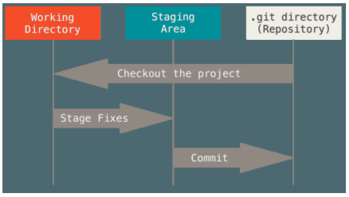

# Git Basics

## Snapshots, Not Differences
Conceptually, most other systems store information as a list of file-based changes. These other systems (CVS, Subversion, Perforce, Bazaar, and so on) think of the information they store as a set of files and the changes made to each file over time (this is commonly described as delta-based version control).

Git thinks of its data more like a series of snapshots of a miniature filesystem. With Git, every time you commit, or save the state of your project, Git basically takes a picture of what all your files look like at that moment and stores a reference to that snapshot.

To be efficient, if files have not changed, Git doesn’t store the file again, just a link to the previous identical file it has already stored. Git thinks about its data more like a stream of snapshots.

## Three states of your Git repository files
Git has three main states that your files can reside in: committed,
modified, and staged:
- Committed means that the data is safely stored in your local database.
- Modified means that you have changed the file but have not committed it to your database yet.
- Staged means that you have marked a modified file in its current version to go into your next



## Data recovery with Git repository
Remember, anything that is committed in Git can almost always be recovered. Even commits that were on branches that were deleted or commits that were overwritten with an --amend commit can be recovered

## Git Config
 These variables can be stored in three different places:
- `/etc/gitconfig` file: Contains values **applied to every user on the system** and all their repositories. If
you pass the option `--system` to `git config`, it reads and writes from this file specifically. (Because
this is a system configuration file, you would need administrative or superuser privilege to make
changes to it.)
- `~/.gitconfig` or `~/.config/git/config` file: **Values specific personally to you**, the user. You can make Git read and write to this file specifically by passing the --global option.
- `config` file in the Git directory (that is, `.git/config`) of whatever repository you’re currently using: Specific to that single repository.

**Setting user in Git config**    
Set your user name and email address:

````
git config --global user.name "John Doe"
git config --global user.email johndoe@example.com
````

**Setting editor**
You can configure the default text editor that will be used when Git needs you to type in a message:

````
git config --global core.editor "'C:/Program Files/Notepad++/notepad++.exe' -multiInst -nosession"
````

**Viewing the settings**
To view all the properties:

````
git config --list
````

To check a specific property:

````
git config user.name
````

## Getting info about Git commands
To view help docs about a specific Git command, you can use:

````
git <command-name> --help
````

## Git Ignore file `.gitignore`
- Blank lines or lines starting with # are ignored
- Standard glob patterns work, and will be applied recursively throughout the entire working tree. Glob patterns are like simplified regular expressions that shells use
- You can start patterns with a forward slash (/) to avoid recursivity.
- You can end patterns with a forward slash (/) to specify a directory.
- You can negate a pattern by starting it with an exclamation point (!).
- You can also use two asterisks to match nested directories; `a/**/z` would match `a/z`, `a/b/z`, `a/b/c/z`, and so on.

````
# ignore all
.a files *.a

# but do track lib.a, even though you're ignoring .a files above
!lib.a

# only ignore the TODO file in the current directory, not subdir/TODO
/TODO

# ignore all files in the build/ directory
build/

# ignore doc/notes.txt, but not doc/server/arch.txt
doc/*.txt

# ignore all .pdf files in the doc/ directory and any of its subdirectories doc/**/*.pdf
````

## `git diff`
This command compares what is in your working directory with what is in your staging area. The result tells you the changes you’ve made that you haven’t yet staged.

````
git diff
````

If you’ve staged all of your changes, git diff will give you no output.

This command compares your staged changes to your last commit:

````
git diff --staged
````

## `git commit`
The simplest way to commit is to type:

 ````
 git commit
 ````

This would open the editor that you have configured as part of Git config or the default editor to enter commit message.

````
# Please enter the commit message for your changes. Lines starting
# with '#' will be ignored, and an empty message aborts the commit.
# On branch master # Your branch is up-to-date with 'origin/master'.
# # Changes to be committed:
#	new file:   README
#	modified:   CONTRIBUTING.md
#
~
~
~
".git/COMMIT_EDITMSG" 9L, 283C
````

To view what you are commiting you can use `-v` while doing commit:

````
git commit -v
````

This would include the `git diff` while prompting you for commit message.

You can specify a commit message using:

````
git commit -m "<commit-message-here>"
````

**Skip adding file to staging area**    
Adding the `-a` option to the Git commit command makes Git automatically stage every file that is already tracked before doing the commit, letting you skip the `git add` part:

````
git commit -a
````

## Removing files from git
To remove a file from Git, you have to remove it from your tracked files (more accurately, remove it from your staging area) and also removes the file from your working directory so you don’t see it as an untracked file:

````
git rm <file-name>
````

To remove a file that has already been added to staging area, use `-f` option:

````
git rm -f <file-name>
````

You can pass files, directories, and file-glob patterns:

````
git rm log/\*.log
git rm \*~
````

## Moving Files
If you want to rename a file in Git, you can run something like:

````
git mv <original-file-name> <renamed-file-name>
````

This is equivalent to:

````
mv README.md README
git rm README.md
git add README
````

Although Git figures out that it’s a rename implicitly, so it doesn’t matter if you rename a file that way or with the mv command.

## Viewing commit history
Check commit history of your repository using:

````
git log
````

````
Output here
````

It lists the commits made in that repository in reverse chronological order — that is, the most recent commits show up first. As you can see, this command lists each commit with its SHA-1 checksum, the author’s name and email, the date written, and the commit message.

**number of entries**    
To limit the number of entries listed, just add the number preceded by a hypen `-<n>`:

````
git log -5
````

**--patch or -p**    
Show the difference (the patch output) introduced in each commit:

````
git log -p -1
````

**--stat**    
See abbreviated stats for each commit:

````
git log --stat
````

**--pretty**    
This option takes in the following set of values:

- oneline
- short
- full
- fuller
- format

````
git log --pretty=onelilne
````

````
git log --pretty=format:"%h - %an, %ar : %s"
````

Useful options for `git log --pretty=format`

````
%H Commit hash

%h Abbreviated commit hash

%T Tree hash

%t Abbreviated tree hash

%P Parent hashes

%p Abbreviated parent hashes

%an Author name

%ae Author email

%ad Author date (format respects the --date=option)

%ar Author date, relative

%cn Committer name

%ce Committer email

%cd Committer date

%cr Committer date, relative

%s Subject
````

**--graph**    
This option shows a ASCII based graph showing branch and merge history:

````
git log --graph
````

**--name-only**    
Shows the list of files modified for a given commit along with the commit information:

````
git log --name-only
````

**--name-status**    
This shows status in addition to what is shown with `--name-only` against each file name:

````
git log --name-status
````


**--since**   
This is used to limit the commits list to certain time or date:

````
git log --since="2 days"

git log --since="2008-01-15"
````

Alternative to this are `--after`, `--until`, `--before`.

**--grep**   
Used to filter commits containing a certain text:

````
git log --grep="<search-text>"
````

**-S**    
If you wanted to find the commit that changed a certain string say a function name:

````
git log -S <search-text>
````

## Undo Actions
### Fixing your commit
If you miss adding files to the commit or you need to change the commit message, you can use `--amend`:

````
git commit --amend
````

This command works with the `staging area`. And this commit and the last commit would create a single commit in git.

## Unstaging a staged file
To Unstage a staged file:

````
git reset HEAD <file-name>
````

You can also easily remove files from your staging area:

```
git rm --cached index.html style.css
```

If you want to remove folders as well you also need to add the -r flag to the command:

```
git rm --cached -r images
```

To remove all files and folders from the staging area:

```
git rm --cached -r .
```

## Discard changes to a file
To discard changes in working directory for a file:

````
git checkout <file-name>
````

## Remote Repositories
### Getting info about remote server
To get the remove server configured for the remote repository:

````
git remote
````

If you only one repository, this would output:

> origin

To also see the url that Git uses to connect to this remote repository:

````
git remote -v
````

> git remote -v    
> origin	https://github.com/jsbisht/TicTacToe.git (fetch)    
> origin	https://github.com/jsbisht/TicTacToe.git (push)

### Adding custom name to remote repository
`git clone` adds *origin* implicitly to the remote repository.

To add custom name to the remote repository:

````
git remote add <repo-shortname> <git-url>
````

Example:

```
git remote add origin https://www.github.com/your-online-repo
```

### Verify remote repository
You can also verify the new remote URL with the following command:

```
git remote -v
```

### Fetching from the remote repositories
To get new changes that remote has but the local repo doesnt:

````
git fetch <repo-shortname>
````
This commands only downloads the data to the local repo, but doesnt merge it automatically. To get and merge the latest, you need to do a `git pull` (only if the remote branch is setup to track a remote branch).

### Info about the remote repository
To view details about the remote repository:

````
git remote show <repo-shortname>
````

````
git remote show origin
* remote origin
  Fetch URL: https://github.com/jsbisht/TicTacToe.git
  Push  URL: https://github.com/jsbisht/TicTacToe.git
  HEAD branch: master
  Remote branch:
    master tracked
  Local branch configured for 'git pull':
    master merges with remote master
  Local ref configured for 'git push':
    master pushes to master (up to date)
````

This command is useful to understand where does the default `push` and `pull` is configure to.

### Pulling and Pushing to remote repository
To push the changes to remote repository:

````
git pull <repo-shortname> <branch-name>
git push <repo-shortname> <branch-name>
````

If the remote is configured to push to the `<branch-name>` by default, you can simply use:

````
git pull
git push
````

### Renaming and Removing Remotes
To rename Git remote shortname:

````
git remote rename <current-short-name> <new-short-name>
````

To remove a Git remote that have been moved or is no longer required:

````
git remote remove <short-name>

OR

git remote rm <short-name>
````

## Git Tags
### Retrieving Tags
The order of tags is alphabatical. To get the list of tags:

````
git tag
````

To list tags matching a certain pattern text:

````
git tag -l "<text-to-search>"
````

### Creating Tags
There are two types of tags:
- lightweight
- annotated


**lightweight**    
It just works as a pointer to a specific commit.

````
git tag <tag-name>
````

This creates a tag, which is composed of the commit checksum.

**annotated**    
To create one you can do:

````
git tag -a <tag-name>
````

This also requires us to pass an message. So, to pass message along with tag name use:

````
git tag -a <tag-name> -m <tag-message>
````

If a message is not passed, git would prompt you to pass one.


### Tagging an old commit
You can tag an old commit by using its hash code using `git log`.

````
git log --pretty=oneline
````

>      
> ac63512042abcbbb1d2481b35e285af973127769 A simple Tic Tac Toe game implemented
>    

Now to tag:

````
git tag -a <tag-name> <hash-text>
````

### Pushing your tag to remote repo
Just like we push a newly created branch on local to remote repo, we have to push tags. To push tags:

````
git push origin <tag-name>
````

If pushing a number of tags:

````
git push origin --tags
````

### Viewing details of a tag
To view details of a tag:

````
git checkout <tag-name>
````

Once a tag is checked out, current repository is in `detached HEAD`. If you make changes and commit them, they wont belong to any branch. Making commits wont affect the tag. Create a new branch to retain the commits:

````
git checkout -b <new-branch-name>
````

## Git Alias
Git alias allows us to type short form of a *git command*. To create a alias, add a `git config`.

````
git config --global alias.<shortcut> <command>
````

Here are few examples of the same:

````
git config --global alias.co checkout
git config --global alias.br branch
git config --global alias.ci commit
git config --global alias.st status
git config --global alias.last 'log -1 HEAD'
````

So, you can use the alias as follows:

````
git co

git br

git ci

git st

git last
````

# Git Branching
Git encourages workflows that branch and merge often.

## How Git Commit works
A commit stores checksum for each file that is being committed. Git commit also create checksum for each directory and stores those in Git repository.
- One blob would be created for each file which also contains the checksum for the file
- One blob for directory with checksum of directory and also list checksums for the files contained
- One blob would be created for the commit. If this is the first commit, it would be a initial commit. If its a subsequent one, than this would point to the previous commit.


When you make a commit, Git stores a commit object that *contains a pointer to the `snapshot`* of the content you staged.

Git commit object stores:
- zero parents for the initial commit
- one parents for a normal commit
- multiple parents for a commit that is result of merge of two or more branches

## What is a Git Branch
A branch is pointer to one of the commits. By default we get `master` branch whose pointer moves as we make commits to the branch.


Because a branch in Git is actually a simple file that contains the 40 character SHA-1 checksum of the commit it points to, branches are cheap to create and destroy.

### Creating a Git branch
To create a new branch:

````
git branch <new-branch-name>

OR

git branch testing
````

NOTE: This command does not switch your current branch to `<new-branch-name>`.

Git maintains a pointer `HEAD` to keep track of which branch is currently being used. This is evident if you try to get list of branches you have on your local:

````
git branch
````

> \* master   
>    develop   
>    features
>    testing

The branch name preceded with `\*` is the one the `HEAD` is pointing to currently.

### Switching branches
This move the `HEAD` point to the `<branch-name>`. To switch a branch:

````
git checkout <branch-name>

OR

git checkout testing
````

If a new commit happens, the current branch moves ahead from the branch it was created from.

A new commit on existing branch(`master`) after new branch creation(`testing`) moves it away from this branch as well.


### Create and switch to branch
To create a new branch and switch to that using single command:

````
git checkout -b <branch-name>
````

## Basic Branching and Merging
### Switch branch
To switch to another branch, any changes in the working directory or staging area should not conflict with branch you are checking out. We can either:
- commit
- clean
- stash

When you switch branches, Git adds, removes, and modifies files automatically to make sure your working copy is what the branch looked like on your last commit to it.

### Merge
To merge a newly created branch back to existing branch(`master`), you can do a merge as follows:

````
git checkout master
git merge testing
````

Git `fast-forwards` the branch(`master`) to branch it was merged to(`testing`).

So, now all the changes that were in `testing` are available on `master` branch as well.

### Delete the branch
Now you can delete the newly created branch(`testing`). To delete the branch `locally`:

````
git branch -d testing
````

Delete the remote branch:

````
git push origin --delete <branch-name>
````

### Merge after branches diverged

If master has commits after it was used to branch out, it diverges from that branch. And say if that branch as well has commits, then both branches has divereged.


Once we merge these two branches as follows:

````
git checkout master

git merge iss53
````

Since the commit on the branch you’re on isn’t a direct ancestor of the branch you’re merging in, Git has to do some work. In this case, Git does a simple three-way merge, using the two snapshots pointed to by the branch tips and the common ancestor of the two.


Instead of just moving the branch pointer forward, Git creates a new snapshot that results from this three-way merge and automatically creates a new commit that points to it. This is referred to as a merge commit, and is special in that it has more than one parent.


It’s worth pointing out that Git determines the best common ancestor to use for its merge base.

**Clean Merge**
If the merge is successful, then you have a clean merge.

**Merge conflicts**
If you changed the same part of the same file differently in the two branches you’re merging together, Git won’t be able to merge them cleanly.

If this is the case, Git won’t automatically create a new merge commit. It pauses the process while you resolve the conflict. If you want to see which files are unmerged at any point after a merge conflict, you can run:

````
git status
````

> On branch master
> You have unmerged paths.
>   (fix conflicts and run "git commit")
>
> Unmerged paths:
>   (use "git add <file>..." to mark resolution)
>
>     both modified:      index.html
>
> no changes added to commit (use "git add" and/or "git commit -a")


*Anything that has merge conflicts and hasn’t been resolved is listed as unmerged.*

**Unmerged Paths**
Git adds standard conflict-resolution markers to the files that have conflicts:

````
  <<<<<<< HEAD:index.html
  <div id="footer">contact :   email.support@github.  com</div>
  =======
  <div id="footer">
   please contact us at   support@github.com
  </div>
  >>>>>>> iss53:index.html
````

The top part is the change belonging to the branch to which we are merging to(`master`). And the bottom part is the change coming from branch we are merging(`iss53`).

To merge just remove the whole thing with the change you would like to keep there.

*Once merged add the files to staging area to mark them as resolved.*

**Graphical merge tool**
You can merge using a GUI based tool using:

````
git mergetool
````

## Remote Branches
### Remote references
Remote tracking branches are the references to the state of the remote branches. They’re local references that you can’t move. Think of them as bookmarks, which keep tracks where your remote repositories were when last time you connected or pulled from them.

### Push local branch to remote with a different name
To push your current local branch to remote with a different name:

````
git push origin <local-branch-name>:<new-branch-name>

git push origin localbranch:newname
````

### Save your username and password credential
While using HTTPS URL to connect to git, we will be prompted to enter our username and password, so that server can verify if we are permitted for a certain action. Git allows you to save your credential, so you dont have to reenter these for every operation. To save you credential:

````
git config --global credential.helper cache
````

### Tracking Branches
Checking out a local branch from a remote-tracking branch automatically creates what is called a `tracking branch` and the branch it tracks is called an `upstream branch`.

To get a remote branch of your branch:

````
git checkout --track <repo-name>/<branch-name>

git checkout --track origin/develop
````

This will setup local branch which tracks the remote `develop` branch.

An alternative to the same command is:

````
git checkout <branch-name>
````

### Setup local branch with different name than remote branch

````
git checkout -b <new-name> <repo-name>/<branch-name>

git checkout -b dev origin/develop
````

### Setup local branch to remote upstream
To setup a local branch to track a remote branch, or change the remote branch your local is tracking:

````
git branch -u <repo-name>/<branchname>
````

### Get info about branches
Git allows you to see all your branches along with the commit hash and message. To list what commit your branch is pointing to:

````
git branch -v
````

To know what each branching is tracking and list if your command is ahead or behind from the remote:

````
git branch -vv
````

This would also list branches that are not tracking any remote repo. And commit info will not be preceded with any remote branch name in such case.

Both of the above mentioned commands would get info based on what it cached when it fetched from server the last time. So, this might not be upto date info.

````
git fetch --all; git branch -vv
````

### Deleting Remote Branches
To delete a remote branch from the server:

````
git push origin --delete <branch-name>
````

## Rebasing
### Basic Rebase
When two branches have diverged then, we can merge the two branches with either:
- merge
- rebase

**Merging using `git merge`**


To merge these branches using `merge` command will result into the following commit added after the merge.

````
git checkout master
git merge experiment
````


**Merging using `git rebase`**
Using rebase you can attach changes of your branch on top of commits in target branch.

````
git checkout master
git rebase experiment
````

> First, rewinding head to replay your work on top of it...
> Applying: added staged command


Once rebase is done, you need to fast-forward the target branch.

````
git checkout master
git merge experiment
````


Now, the snapshot pointed to by C4' is exactly the same as the one that was pointed to by C5 in the merge example. There is no difference in the end product of the integration, but rebasing makes for a cleaner history. If you examine the log of a rebased branch, it looks like a linear history: it appears that all the work happened in series, even when it originally happened in parallel.

Rebasing replays changes from one line of work onto another in the order they were introduced, whereas merging takes the endpoints and merges them together.

### Advanced rebases
Say you branched out(`client`) of branch(`server`) from the main branch. And now both the branched out branches have some commits.


Say, you want to merge changes in `client` to `master`:

````
git rebase --onto master server client
````

This command instruct git to pick the patches that were made into `master` since `client` diverged from `server`.


The `client` will look like as if it was directly branched out of `master`. Now you can fast-forward `master` to merge the `client` changes.

````
git checkout master
git merge client
````


