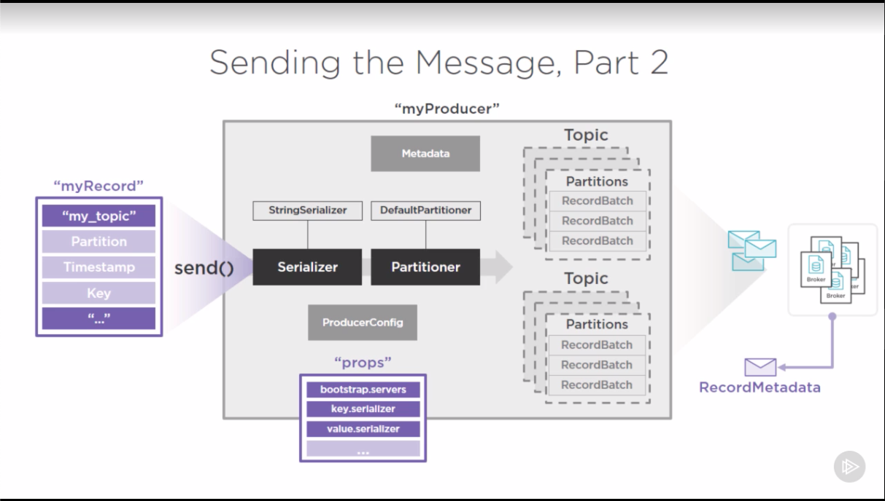

# Kafka Basics

## Understanding Topics, Partitions and Brokers
Behind the scene kafka maintains one or more log file for a single topic. Each topic has one or more partitions. Each partition is maintained on one or more broker.

### Topic

Behind the scene kafka maintains one or more log file for a single topic.

> Event Sourcing: All changes in an application are captured as a sequence of time ordered, immutable events.

#### Offset

- Last read message position
- Maintained by Kafka consumer

#### Message Retention Policy

- Kafka retains all the messages regardlesss of the consumption
- Retention period by default is 7 days (168 hours)
- Retention period is set per topic basis

#### Hands On
Go to kafka folder:

> cd /Users/jsbisht/Softwares/packages/kafka_2.11-2.1.0

Start Zookeeper:

> bin/zookeeper-server-start.sh config/zookeeper.properties

Start Kafka:

> bin/kafka-server-start.sh config/server.properties

Creating Topic:

> bin/kafka-topics.sh --create --topic my_topic --zookeeper localhost:2181 --replication-factor 1 --partitions 1

Listing Topics:

> bin/kafka-topics.sh --list --zookeeper localhost:2181

Consuming Messages:

> bin/kafka-console-producer.sh --zookeeper localhost:9092 --topic my_topic

### Partitions

Each topic has one or more partitions. Each partition is maintained on one or more broker.

A partition forms basis on which Kafka can:

* Scale
* Become fault tolerant
* Achive higher throughput

*NOTE:* Each partition must reside on single machine. A partition cannot be split across multiple machines.

So for scalability messages of a single topic is split across different partitions (which message goes to which partition is determined by partition scheme).

* more the partition, more the work zookeper has to do to manage those.
* ordering messages can become difficult.
* increases the leader fail-over time.

To alter the number of partitions:

> bin/kafka-topics.sh --zookeeper localhost:2181 --alter --topic my-topic --partition <new-partition-count>

#### Replication Factor
``
* Reliable work distribution
* Cluster resiliency
* Fault Tolerance
* Guarentees N-1 failure tolerance
* Configured on per topic basis

Each broker updates the replicated node and increments the ISR (In Sync Replicas). When the ISR is equal to replication factor, we would know the replication is completed.

### Broker

Each broker has its own `server-X.properties` file.

> bin/kafka-topics.sh --describe --topic my_topic --zookeeper localhost:2181

## Producing Messages with Kafka

Kafka producer requires:

* bootstrap.servers
* key.serializer (Specify classes to be used for serialization and deserialization)
* value.serializer (Specify classes to be used for serialization and deserialization)

### Producer Config

When a kafka producer is initialized, it uses `ProducerConfig` to initialize the props mentioned above into the producer object. 

### Producer Record

Kafka producer produces a record (doesnt calls it message). It uses `ProducerRecord` containing required fields ***Topic*** and ***Value***. The value type should match the serializer specified in the producer bootstrap. Once ready this message is sent to the consumers to consume.


```java
import org.apache.kafka.clients.producer.KafkaProducer;
import org.apache.kafka.clients.producer.ProducerRecord;

import java.util.Properties;

public class KafkaProducerApp {
    public static void main(String[] args) {
        Properties props = new Properties();
        props.put("bootstrap.servers", "BROKER-1:9092, BROKER-2:9093");
        props.put("key.serializer", "org.apache.kafka.common.serialization.StringSerializer");
        props.put("value.serializer", "org.apache.kafka.common.serialization.StringSerializer");

        KafkaProducer myProducer = new KafkaProducer(props);
        ProducerRecord myRecord = new ProducerRecord("my_topic", "Cource-001", "My Message 1");
        myProducer.send(myRecord);  // Use try-catch here
    }
}
```

Producer uses `StringSerializer` while creating the record before it calls the `send()`.

### Kafka Producer Partitioning Strategy

Before sending in the records among different partitions available, Kafka Producer uses the following strategies:

* direct
* round-robin
* key mod-hash
* custom

#### Direct

Used when the `ProducerRecord` has a valid **partition** mentioned.

#### Round Robin

Used when **partition** and a **key** is *NOT* specified into the `ProducerRecord`. This strategy evenly distributes the records among the available partitions using `DefaultPartitioner`.

#### Key Mod-Hash

This strategy is used when `ProducerRecord` has a **key** specified but there is the custom partitioner specified. So, kafka producer uses `DefaultPartitioner` to distribute this

#### Custom

If `ProducerRecord` has a **key** specified and a custom partitioner class exists, this strategy is applied.

### Sending the message to broker

To efficiently send the messages to the broker `RecordAccumulator` is used to send out the messages in *batch*. Message buffering uses `RecordBatch` to hold the records until either **batch.size** or **max.block.ms** is reached.

Broker sends back the acknowledgement which contains information about how many records were successfully received. Broker acknowledgement has the following categories:

* 0: fire and forget (Used for lossful data such as clickstream data)
* 1: leader acknowledgement (Only the leader in the quorum sends acknowledgement among all)
* 2: replication quorum acknowledged (All in sync replica send the acknowledgement)

In case of error in sending, the producer can try resending the batch depending on **retries** and **retry.backoff.ms** configuration. 



### Message Order Guarentees (?)

* Message order by partition
* Ordering while error occurs using `max.in.flight.request.per.connection`
* Delivery semantics: at-most-once, at-least-once, only-once


## Consuming messages with Kafka

Kafka producer requires:

* bootstrap.servers
* key.deserializer (Specify classes to be used for serialization and deserialization)
* value.deserializer (Specify classes to be used for serialization and deserialization)

Similar to Kafka Producer.

```java
import org.apache.kafka.clients.consumer.KafkaConsumer;
import org.apache.kafka.clients.consumer.ConsumerRecord;

import java.util.Properties;

public class KafkaConsumerApp {
    public static void main(String[] args) {
        Properties props = new Properties();
        props.put("bootstrap.servers", "BROKER-1:9092, BROKER-2:9093");
        props.put("key.deserializer", "org.apache.kafka.common.serialization.StringDeserializer");
        props.put("value.deserializer", "org.apache.kafka.common.serialization.StringDeserializer");

        KafkaConsumer myConsumer = new KafkaConsumer(props);
        myConsumer.subscribe(Arrays.asList("my-topic"));
        myConsumer.subscribe(Arrays.asList("my-*"));    // using regex
    }
}
```

### Subscribe and Assign api's

**subscribe()**

Used to subscribe to:

* Topic (dynamic/automatic) (?)
* One topic, one-to-many partitions
* Many topic, many-to-many partitions

Advantage of using subscribe is that the consumer would automatically subscribe to newer partitions as well.

**assign()**

Used to subscribe to:

* single partitions, regardless of the topic
* partitions we are interested in is specified manually
* any new partition added would be conveyed to the consumer

## Tips

* Use `kafka-producer-perf-test.sh` file to generate fixed number of records automatically. 